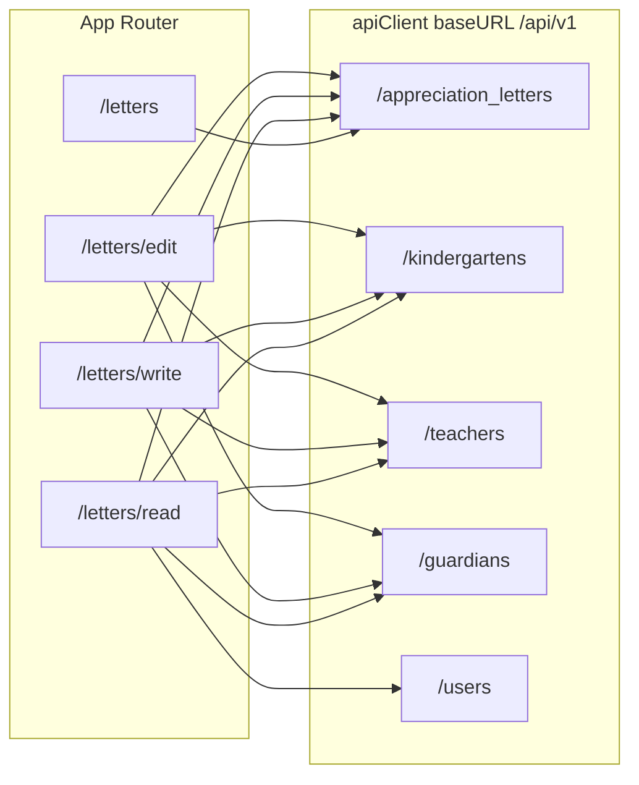

# 감사 편지 — 프론트엔드 연동 가이드 (전체 구조·파일 상세)

본 문서는 **현재 저장소에 구현된 감사 편지 기능**을 기준으로, **디렉터리 구조**, **파일별 역할**, **API·데이터 흐름**, **권한(보호자)**, **작성자 표시(이름·로그인 ID·회원 ID)**, **알려진 이슈**를 한 문서에 정리한다.  
백엔드·DB 스키마와의 대응, 공지사항 모듈과의 차이, 레거시 API와의 구분도 포함한다.

---

## 목차

1. [디렉터리·파일 구조 (트리)](#1-디렉터리파일-구조-트리)
2. [아키텍처 요약](#2-아키텍처-요약)
3. [한눈에 보기](#3-한눈에-보기)
4. [라우팅 (Next.js App Router)](#4-라우팅-nextjs-app-router)
5. [환경 변수·HTTP 클라이언트](#5-환경-변수http-클라이언트)
6. [도메인·DB 매핑](#6-도메인db-매핑)
7. [REST: 감사 편지](#7-rest-감사-편지)
8. [REST: 연관 API (유치원·교사·보호자·사용자)](#8-rest-연관-api-유치원교사보호자사용자)
9. [프론트 타입·상수·역할](#9-프론트-타입상수역할)
10. [API 모듈 상세](#10-api-모듈-상세)
11. [라이브러리 유틸](#11-라이브러리-유틸)
12. [컴포넌트별 명세](#12-컴포넌트별-명세)
13. [로그인 세션·회원 ID(user_id)](#13-로그인-세션회원-iduser_id)
14. [보호자 전용 정책 (프론트·백엔드)](#14-보호자-전용-정책-프론트백엔드)
15. [더미 데이터·오프라인 폴백](#15-더미-데이터오프라인-폴백)
16. [트러블슈팅·구현 갭](#16-트러블슈팅구현-갭)
17. [파일 전체 목록 (경로 + 설명)](#17-파일-전체-목록-경로--설명)
18. [레거시 ThankLetter와의 차이](#18-레거시-thankletter와의-차이)

---

## 1. 디렉터리·파일 구조 (트리)

감사 편지 기능이 **실제로 터치하는 프론트 경로**를 트리로 정리한다. (`frontend/src` 기준)

```
src/
├── app/
│   └── letters/
│       ├── page.tsx                 # 목록 라우트 → AppreciationLettersListPage
│       ├── read/page.tsx          # 상세 (?id=) → AppreciationLettersDetailPage + Suspense
│       ├── write/page.tsx         # 작성 → AppreciationLettersWritePage
│       └── edit/page.tsx          # 수정 (?id=) → AppreciationLettersEditPage + Suspense
├── components/
│   └── letters/
│       ├── AppreciationLettersListPage.tsx    # 목록 데이터·페이지네이션·더미 병합
│       ├── AppreciationLettersListForm.tsx  # 목록 UI (검색·테이블·글쓰기 버튼)
│       ├── AppreciationLettersDetailPage.tsx # 상세·작성자 메타·대상 요약·수정/삭제·삭제 모달
│       ├── AppreciationLettersWritePage.tsx  # 작성 폼·권한·LetterTargetPicker·GuardianAuthorCard
│       ├── AppreciationLettersEditPage.tsx   # 수정 폼·작성자 검증·프리셋 피커
│       ├── LetterTargetPicker.tsx            # 유치원/교사 대상 선택 (2단계)
│       └── GuardianAuthorCard.tsx            # 세션 작성자: 이름·로그인 ID·회원 ID (보호자 API)
├── services/apis/
│   ├── apiClient.ts               # Axios 인스턴스·토큰·401 refresh
│   ├── appreciationLetters.api.ts
│   ├── kindergartens.api.ts
│   ├── teachers.api.ts
│   ├── guardians.api.ts          # by-user, by-login-id, resolveGuardianNameFromUserKeys
│   └── usersPublic.api.ts        # getUserById — 상세 작성자 로그인 ID
├── types/
│   ├── appreciationLetter.ts     # VO·target/status 상수
│   └── user-role.ts              # UserRole, canWriteAppreciationLetters 등
├── lib/
│   ├── appreciation-letter-utils.ts
│   ├── api-error-message.ts
│   └── dummy-data/
│       └── appreciationLetters.ts
├── config/
│   └── api.ts                    # NEXT_PUBLIC_API_BASE_URL
├── store/
│   └── slices/userSlice.ts       # user.id, loginId, role, token
├── components/auth/
│   └── LoginForm.tsx             # 로그인 후 user.id ← TokenVO.id
└── components/home/
    └── LoginModal.tsx            # 동일 패턴으로 user.id 설정
```

**메뉴 진입:** 상단 메뉴는 DB `menus`·`/api/v1/menus?roleType=`로 내려오며, 시드에 `/letters`가 있으면 노출된다 (`db/initdb/02_menu.sql` 참고). `TopBar`는 `menu.api` 결과를 쓰고, 메뉴가 비면 홈/공지 폴백만 쓴다.

---

## 2. 아키텍처 요약



- **편지 CRUD** → `appreciation_letters`
- **대상 선택** → `kindergartens`, `teachers`
- **작성자 이름(`guardians.name`)** → `guardians/by-user/{userId}` 우선, 필요 시 `by-login-id/{loginId}` (`resolveGuardianNameFromUserKeys`)
- **상세에서 타인 작성자의 로그인 ID** → `users/{senderUserId}` (`UserVO.loginId`; 백엔드 `UserMapper`에서 `id`→`userId` 매핑 필요)

---

## 3. 한눈에 보기

| 구분 | 내용 |
|------|------|
| **앱 URL** | `/letters`, `/letters/read?id=`, `/letters/write`, `/letters/edit?id=` |
| **REST (서버)** | `/api/v1/appreciation_letters` |
| **프론트 axios 경로** | `/appreciation_letters`, `/appreciation_letters/{id}` (`baseURL`에 `/api/v1` 포함) |
| **DB 테이블** | `appreciation_letters` |
| **대상** | `targetType`: `KINDERGARTEN` \| `TEACHER` + `targetId` |
| **본문 필드** | `content` (공지 `body` 아님) |
| **PK JSON** | `letterId` |
| **목록 size** | 20 (`APPRECIATION_LETTERS_PAGE_SIZE`) |
| **작성자 표시 순서 (UI)** | **이름** (`guardians.name`) → **로그인 ID** → **회원 ID** (`sender_user_id` / 세션 `user.id`) |
| **감사 편지 작성** | 역할 `GUARDIAN` + 백엔드에서 `senderUserId`에 대한 `guardians` 행 존재 검증 |

---

## 4. 라우팅 (Next.js App Router)

| URL | 파일 | 래핑 | 주 컴포넌트 |
|-----|------|------|-------------|
| `/letters` | `app/letters/page.tsx` | `Suspense` | `AppreciationLettersListPage` |
| `/letters/read` | `app/letters/read/page.tsx` | `Suspense` | `AppreciationLettersDetailPage` |
| `/letters/write` | `app/letters/write/page.tsx` | 없음 | `AppreciationLettersWritePage` |
| `/letters/edit` | `app/letters/edit/page.tsx` | `Suspense` | `AppreciationLettersEditPage` |

**쿼리:** 상세·수정은 **`id`** = `letterId`. 파싱은 `parseLetterIdQueryParam` (`lib/appreciation-letter-utils.ts`).

---

## 5. 환경 변수·HTTP 클라이언트

| 파일 | 역할 |
|------|------|
| `config/api.ts` | `API_BASE_URL` = `NEXT_PUBLIC_API_BASE_URL` 또는 `http://localhost:8080/api/v1` |
| `services/apis/apiClient.ts` | `baseURL: API_BASE_URL`, 요청에 Bearer, 401 시 `auth/refresh` 재시도 |

모든 감사 편지·연관 API는 **`apiClient`**로만 호출하는 것이 원칙이다.

---

## 6. 도메인·DB 매핑

`db/initdb/01_create_schema.sql` — `appreciation_letters` 주요 컬럼과 JSON 필드:

| DB | JSON (camelCase) |
|----|------------------|
| `letter_id` | `letterId` |
| `kindergarten_id` | `kindergartenId` |
| `sender_user_id` | `senderUserId` |
| `target_type` | `targetType` |
| `target_id` | `targetId` |
| `title` | `title` |
| `content` | `content` |
| `is_public` | `isPublic` |
| `status` | `status` |
| `created_at` / `updated_at` | `createdAt` / `updatedAt` |

**제출 시 의미**

- `KINDERGARTEN`: `targetId` = 유치원 ID (= `kindergartenId`).
- `TEACHER`: `targetId` = `teachers.teacher_id`, `kindergartenId` = 해당 교사 소속 원.

---

## 7. REST: 감사 편지

컨트롤러: `AppreciationLetterController`, 베이스 `/api/v1/appreciation_letters`.

| 메서드 | 경로 | 설명 |
|--------|------|------|
| GET | `/appreciation_letters` | 목록 `Pageable`, `keyword`는 서비스 TODO(필터 미적용 가능) |
| GET | `/appreciation_letters/{id}` | 단건 |
| POST | `/appreciation_letters` | 생성 |
| PUT | `/appreciation_letters/{id}` | 수정 |
| DELETE | `/appreciation_letters/{id}` | 204, 물리 삭제 |

**보호자 검증 (백엔드):** `AppreciationLetterService`에서 생성·수정 시 `senderUserId`(또는 갱신 후 엔티티의 발신자)에 대해 `GuardianRepository.findByUser_Id` 존재 여부 확인. 없으면 **403**.

---

## 8. REST: 연관 API (유치원·교사·보호자·사용자)

### 8.1 유치원 — `kindergartens.api.ts`

- `GET /kindergartens` — `searchKindergartens`
- `GET /kindergartens/{id}` — `getKindergarten`

### 8.2 교사 — `teachers.api.ts`

- `GET /teachers` — `searchTeachers` (`kindergartenId`, `keyword`, 페이지)
- `GET /teachers/{id}` — `getTeacher`
- `normalizeTeacherVO` / `firstPositiveLong`: `teacherId` null→0 표시 버그 방지

### 8.3 보호자 — `guardians.api.ts` + `GuardianController`

| HTTP | 경로 | 용도 |
|------|------|------|
| GET | `/guardians/by-user/{userId}` | `users.user_id` → `GuardianVO` (이름 = `guardians.name`) |
| GET | `/guardians/by-login-id/{loginId}` | `users.login_id` → 동일 |
| GET | `/guardians/{id}` | 보호자 PK (감사 편지 UI에서는 주로 미사용) |

프론트 헬퍼 **`resolveGuardianNameFromUserKeys`**: 먼저 `by-user`, 실패 시 `by-login-id`.

### 8.4 사용자 — `usersPublic.api.ts`

- `GET /users/{id}` — `getUserById` → `loginId`, `userId` 표시용  
- 백엔드 `UserMapper.toVO`에서 **`userId` ← 엔티티 `id`** 매핑이 되어 있어야 JSON에 `userId`가 채워진다.

---

## 9. 프론트 타입·상수·역할

### `types/appreciationLetter.ts`

- `AppreciationTargetType`, `AppreciationLetterStatus`
- `AppreciationLetterVO`
- `APPRECIATION_LETTER_STATUS_OPTIONS`, `APPRECIATION_TARGET_TYPE_OPTIONS`

### `types/user-role.ts`

- `UserRole`, `USER_ROLES`, `roleLabels`, `rolePermissions`, `menuApiRoleType`
- **`canWriteAppreciationLetters(role)`** → `role === 'GUARDIAN'` (감사 편지 글쓰기·수정 진입·목록 글쓰기 버튼)
- `canManageAnnouncements` — 공지용(감사 편지와 별개)

---

## 10. API 모듈 상세

### `appreciationLetters.api.ts`

| 심볼 | 설명 |
|------|------|
| `PageResponse<T>` | Spring Data Page JSON |
| `AppreciationLetterWritePayload` | 생성·수정 body |
| `APPRECIATION_LETTERS_PAGE_SIZE` | `20` |
| `getAppreciationLetters` | 쿼리: `page`, `size`, `keyword`, `sort` |
| `getAppreciationLetterDetail` | **동일 ID in-flight dedup** (`detailInFlight` Map) |
| `createAppreciationLetter` | POST |
| `updateAppreciationLetter` | PUT |
| `deleteAppreciationLetter` | DELETE |

### `guardians.api.ts`

| 심볼 | 설명 |
|------|------|
| `GuardianVO` | 백엔드 VO 대응 타입 |
| `getGuardianByUserId` | 404 → `null` |
| `getGuardianByLoginId` | `encodeURIComponent` 경로 |
| `resolveGuardianNameFromUserKeys` | 이름 조회 통합 |

### `usersPublic.api.ts`

| 심볼 | 설명 |
|------|------|
| `UserAccountVO` | 표시용 필드 (`userId`, `loginId`, …) |
| `getUserById` | 404 → `null` |

---

## 11. 라이브러리 유틸

### `lib/appreciation-letter-utils.ts`

`resolveAppreciationLetterId`, `isSameAppreciationLetterAuthor`, `parseLetterIdQueryParam`, 날짜 포맷, `letterStatusLabel`, `targetTypeLabel`, `parseLetterStatus`.

### `lib/api-error-message.ts`

`getApiErrorMessage` — 작성/수정 실패 토스트 등에 사용 (403 시「권한이 없습니다」 등).

### `lib/dummy-data/appreciationLetters.ts`

목록·상세 API 실패 시 폴백 데이터.

---

## 12. 컴포넌트별 명세

### `AppreciationLettersListPage.tsx`

- **Redux:** `user`, `token`, `isAuthenticated`
- **상태:** `keyword` / `appliedKeyword`, `page`, `totalPages`, `items`, `loading`, `error`
- **데이터:** `getAppreciationLetters` → `mapRowsToListItems` (`resolveAppreciationLetterId`)
- **더미:** `totalElements===0`이면 더미 페이지; 1페이지는 `dummiesBelowApi`로 API 행 아래 데모 행 추가
- **canWrite:** `isAuthenticated && user && token && canWriteAppreciationLetters(user.role)`
- **자식:** `AppreciationLettersListForm`

### `AppreciationLettersListForm.tsx`

- 검색 입력, 글쓰기 링크(`/letters/write`), 목록 링크(`/letters/read?id=`)
- **`hydrated`** 후에만 글쓰기 버튼 (SSR/CSR 불일치 완화)
- 페이지네이션 UI

### `AppreciationLettersDetailPage.tsx`

- **로드:** `getAppreciationLetterDetail` → 실패 시 더미
- **메타 (병렬·견고):** `Promise.allSettled([getUserById(sid), getGuardianByUserId(sid)])`  
  - 이름 없으면 `getGuardianByLoginId(loginFromUser)`  
- **표시 순서:** **이름 | 로그인 ID | 회원 ID** (`letter.senderUserId`)
- **canEdit:** 로그인 + `canWriteAppreciationLetters` + `isSameAppreciationLetterAuthor`
- **삭제:** 커스텀 모달 (`deleteConfirmOpen`), Esc/배경 닫기, `deleteAppreciationLetter` 후 `/letters`
- **대상 줄:** `getTeacher` + `getKindergarten` 또는 `getKindergarten`만

### `AppreciationLettersWritePage.tsx`

- **`mounted` 게이트** 후 로그인/보호자/폼 분기
- **canSubmit:** 로그인 + 토큰 + 유한 `senderNum` + `GUARDIAN`
- 비보호자: 안내 + 목록 링크
- **`GuardianAuthorCard`**, **`LetterTargetPicker`**, `createAppreciationLetter` (`status: 'ACTIVE'`)
- `handleSelectTeacher`: 유효 `teacherId`/`kindergartenId` 아니면 토스트
- 에러: `getApiErrorMessage`

### `AppreciationLettersEditPage.tsx`

- `user?.id` 없으면 로드 스킵(하이드레이션)
- **`!canWriteAppreciationLetters(role)`** 이면 오류 문구만
- 작성자 검증: `isSameAppreciationLetterAuthor` + `getAppreciationLetterDetail`
- `storedSenderUserId`로 수정 시 `senderUserId` 고정
- 교사/유치원 라벨·`presetKindergartenForTeacherFlow` 로드
- `updateAppreciationLetter`, `status: 'ACTIVE'`

### `LetterTargetPicker.tsx`

- 세그먼트: 유치원 / 유치원 교사
- 교사: 유치원 선택 → `searchTeachers({ kindergartenId })`, 폴백 대량 조회+클라이언트 필터
- `useLayoutEffect`로 타입·프리셋 전환 시 상태 정리 (유치원 클릭 직후 선택 유지)
- 리스트 `key` 안전 처리

### `GuardianAuthorCard.tsx`

- **표시:** **이름** (`resolveGuardianNameFromUserKeys`) | **로그인 ID** (`user.loginId`/`username`) | **회원 ID** (`user.id`)
- Redux `user`만 사용

---

## 13. 로그인 세션·회원 ID(user_id)

- 백엔드 로그인 응답 `TokenVO`에 **`id`**(Long) = `users.user_id`.
- **`LoginForm.tsx`**, **`LoginModal.tsx`**: Redux `user.id`에 **`String(response.id)`** 우선 저장 (없을 때만 로그인 문자열 폴백).
- 감사 편지 제출 시 `senderUserId: Number(user.id)` — **숫자 user_id**가 있어야 백엔드 FK·보호자 검증과 일치.
- `isSameAppreciationLetterAuthor`는 `Number` 비교 — 레거시 세션( id=로그인 문자열)이면 본인 판별 실패 가능 → **재로그인** 권장.

---

## 14. 보호자 전용 정책 (프론트·백엔드)

| 층 | 동작 |
|----|------|
| **목록 글쓰기** | `canWriteAppreciationLetters` |
| **작성 페이지** | 비로그인 → 로그인 유도; 비보호자 → 안내 |
| **수정 페이지** | 보호자 아니면 차단; 작성자 불일치 시 메시지 |
| **상세 수정/삭제** | 보호자 + 작성자 일치 |
| **API 생성·수정** | `AppreciationLetterService`에서 해당 `senderUserId`의 guardian 행 필수 (403) |

---

## 15. 더미 데이터·오프라인 폴백

- **파일:** `lib/dummy-data/appreciationLetters.ts`
- **목록:** API 오류 또는 빈 결과 시
- **상세:** `getAppreciationLetterDetail` 실패 시 `getDummyAppreciationLetterById`

운영 검증 시에는 실데이터·실API 기준으로 별도 확인.

---

## 16. 트러블슈팅·구현 갭

| 증상 | 원인·조치 |
|------|-----------|
| 빌드: `canWriteAppreciationLetters` 없음 | `types/user-role.ts`에 함수 export 유지 |
| 이름/로그인 ID 항상 `—` | `user.id` 숫자 여부, `GET /users/{id}`·`UserMapper.userId` 매핑, `GET /guardians/by-user` |
| 교사 ID 전부 0 | `normalizeTeacherVO` + 백엔드 `TeacherMapper`·EntityGraph·재빌드 |
| 목록 검색 무효 | 백엔드 `keyword` TODO |
| 403 작성/수정 | 보호자 행 없음 또는 비보호자 역할 |
| React key 경고 | 교사 key 보조 로직 + 실 ID 정상화 |

---

## 17. 파일 전체 목록 (경로 + 설명)

### Next 라우트

| 경로 | 설명 |
|------|------|
| `frontend/src/app/letters/page.tsx` | 목록 페이지 엔트리, Suspense |
| `frontend/src/app/letters/read/page.tsx` | 상세 엔트리, Suspense |
| `frontend/src/app/letters/write/page.tsx` | 작성 엔트리 |
| `frontend/src/app/letters/edit/page.tsx` | 수정 엔트리, Suspense |

### 컴포넌트 (`components/letters/`)

| 경로 | 설명 |
|------|------|
| `AppreciationLettersListPage.tsx` | 목록 데이터·더미·canWrite·폼에 props 전달 |
| `AppreciationLettersListForm.tsx` | 검색·목록·페이지·글쓰기(보호자만) |
| `AppreciationLettersDetailPage.tsx` | 상세·작성자 3종 메타·대상·수정삭제·삭제 모달 |
| `AppreciationLettersWritePage.tsx` | 작성·권한·대상 피커·보호자 카드 |
| `AppreciationLettersEditPage.tsx` | 수정·권한·프리셋 피커·senderUserId 보존 |
| `LetterTargetPicker.tsx` | 유치원/교사 대상 UI |
| `GuardianAuthorCard.tsx` | 세션 작성자 이름·로그인·회원 ID |

### API·설정

| 경로 | 설명 |
|------|------|
| `frontend/src/services/apis/appreciationLetters.api.ts` | 편지 CRUD·Page 타입·상세 dedup |
| `frontend/src/services/apis/apiClient.ts` | 공통 HTTP |
| `frontend/src/services/apis/kindergartens.api.ts` | 유치원 검색·단건 |
| `frontend/src/services/apis/teachers.api.ts` | 교사 검색·단건·normalize |
| `frontend/src/services/apis/guardians.api.ts` | 보호자 by-user/by-login·이름 resolve |
| `frontend/src/services/apis/usersPublic.api.ts` | 사용자 단건(로그인 ID 표시) |
| `frontend/src/config/api.ts` | API 베이스 URL |

### 타입·유틸·더미

| 경로 | 설명 |
|------|------|
| `frontend/src/types/appreciationLetter.ts` | 편지 도메인 타입·옵션 상수 |
| `frontend/src/types/user-role.ts` | 역할·`canWriteAppreciationLetters` |
| `frontend/src/lib/appreciation-letter-utils.ts` | ID·작성자 비교·포맷·라벨 |
| `frontend/src/lib/api-error-message.ts` | Axios 에러 메시지 |
| `frontend/src/lib/dummy-data/appreciationLetters.ts` | 데모 데이터 |

### 로그인 (감사 편지와 직접 연동)

| 경로 | 설명 |
|------|------|
| `frontend/src/components/auth/LoginForm.tsx` | TokenVO `id` → `user.id` |
| `frontend/src/components/home/LoginModal.tsx` | 동일 |
| `frontend/src/store/slices/userSlice.ts` | `User` 타입·세션 |
| `frontend/src/utils/auth-modal.ts` | `openLoginModal` (작성 페이지 등) |

### 백엔드·DB (참조용)

| 경로 | 설명 |
|------|------|
| `db/initdb/01_create_schema.sql` | `appreciation_letters`, enum |
| `db/initdb/02_menu.sql` | `/letters` 메뉴 |
| `db/initdb/21_users_seed.sql` | 사용자 시드 |
| `db/initdb/29_guardians_seed.sql` | 보호자 `name`·`user_id` 연결 |
| `backend/.../controller/AppreciationLetterController.java` | 편지 API |
| `backend/.../service/AppreciationLetterService.java` | 목록·CRUD·보호자 검증 |
| `backend/.../controller/GuardianController.java` | `by-user`, `by-login-id` |
| `backend/.../service/GuardianService.java` | 보호자 조회 로직 |
| `backend/.../repository/GuardianRepository.java` | `findByUser_Id`, EntityGraph |
| `backend/.../repository/UserRepository.java` | `findByLoginId` |
| `backend/.../mapper/UserMapper.java` | `UserVO.userId` ← `User.id` |
| `backend/.../vo/TokenVO.java` | 로그인 응답 `id` |
| `backend/.../mapper/TeacherMapper.java` / `TeacherService.java` / `TeacherRepository.java` | 교사 VO·로딩 (감사 대상 선택) |

---

## 18. 레거시 ThankLetter와의 차이

과거 **`/api/v1/letters`**, 테이블 `letters`, `body`·`author_id` 등은 **현재 도메인과 다름**.  
본 프로젝트는 **`appreciation_letters`**, **`/api/v1/appreciation_letters`**, **`letterId`**, **`content`** 기준으로 통일한다.

---

*문서 버전: 저장소 코드 기준 (2026-03). 메뉴·보안·API 변경 시 백엔드·DB와 재대조할 것.*
